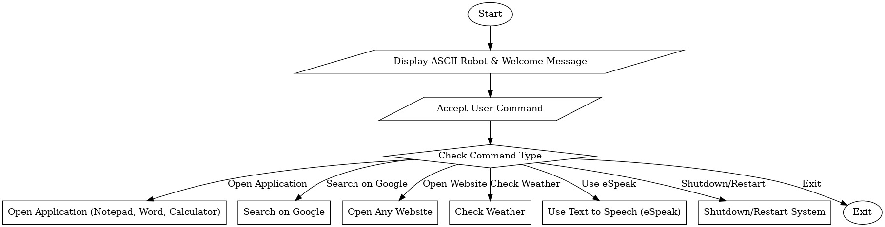
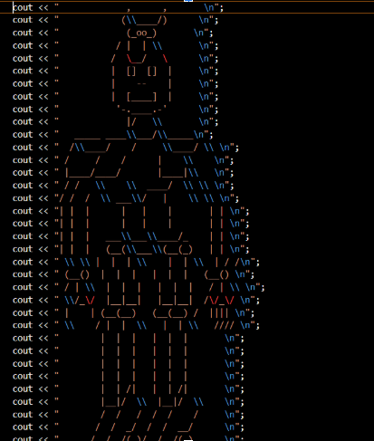

# Personal-Assistant-Mitra-in-C++

### Objective:
Mitra Personal Assistant is a console-based virtual assistant developed in C++, designed to perform system-level tasks and automate routine operations on a Windows OS. The assistant enables users to interact with their system efficiently using text-based commands, reducing manual effort and enhancing productivity.

---

## Features:

### **System Interaction:**
- It can open commonly used applications such as Notepad, Microsoft Word, Calculator, Ms Paint, File Manager and Task Manager providing quick access to essential tools.
### Web Navigation: 
- Users can launch web browsers and directly access popular websites like Google, YouTube, and Gmail, Spotify, JIIT Webportal and E-Commerce websites with simple commands.
### Media Control: 
- The assistant can open the default music directory to play songs effortlessly.
### Utility Functions:
- It can display the current date and time, open the camera, and execute shutdown/restart commands for system management.
### Ask Anything:
- Users can ask any general question, and the assistant will redirect them to Google Search for an instant answer.
### Open Any Website:
- It allows users to open any website by entering the URL.
### Speech Output:
- It integrates eSpeak, allowing the assistant to speak the responses for a more interactive experience.
### Weather Updates:
- Mitra can fetch and display the current weather by redirecting the user to a weather service

---

## Approach:
### **File Handling:** Used to store and retrieve data, such as maintaining logs of executed commands.
### System Calls (Windows API): The assistant interacts with the operating system using functions like system(), allowing it to open applications, websites, and manage system tasks.
### String Manipulation: Processes and analyzes user input to match it with predefined commands.(strcmp)
### Conditional Statements & Loops: Used for command execution flow and keeping the assistant running in a loop.(if-else statement)
### External Library Integration (eSpeak): Enables text-to-speech conversion, making the assistant capable of voice responses.

---
### Flow Chart:
- Initialization: The assistant launches with a greeting and presents a list of available commands.
- User Input: The user enters a command via the console.
- Processing: The system interprets the input and maps it to the corresponding function.
- Execution: Mitra performs the requested task and provides both text and voice-based feedback.
- Continuous Loop: The assistant remains active and awaits further commands.

---
### User Interface using ASCII ART:

---
## Contributors:
- **Prashant Kumar Garg**
- **Kavya Singhal**
- **Krish Mehra**
