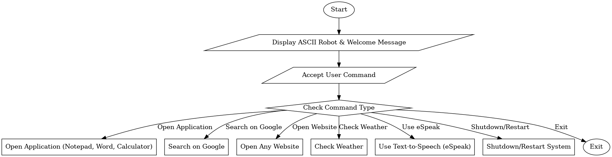
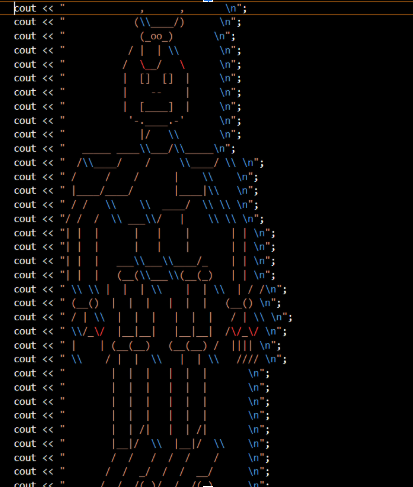

# 🤖 Mitra – Your Personal Assistant (C++ Console App)

**Mitra** is a smart, console-based personal assistant developed in **C++**, designed to automate routine tasks and enhance productivity on **Windows OS**. From opening your favorite apps and websites to fetching the weather and speaking responses – Mitra does it all through simple text commands!

---

## 🌟 Key Features

### 🔧 System Interaction
- Open essential Windows apps like:
  - Notepad
  - Microsoft Word
  - Calculator
  - MS Paint
  - File Explorer
  - Task Manager

### 🌐 Web Navigation
- Launch browsers and access popular websites:
  - Google
  - YouTube
  - Gmail
  - Spotify
  - JIIT Web Portal
  - E-Commerce websites

### 🎵 Media Control
- Play music from the default music directory.

### 🛠️ Utility Functions
- Show **current date & time**
- Open **camera**
- Execute **shutdown** or **restart** commands

### ❓ Ask Anything
- Redirects general questions to **Google Search**

### 🌍 Open Any Website
- Enter any URL to launch it directly

### 🗣️ Speech Output (eSpeak)
- Integrates **eSpeak** for text-to-speech capabilities

### 🌦️ Weather Updates
- Opens a weather website to show the current forecast

---

## ⚙️ Tech Stack & Approach

| Component               | Description |
|------------------------|-------------|
| **File Handling**       | Logs and retrieves executed commands |
| **Windows System Calls**| Uses `system()` to interact with OS features |
| **String Manipulation** | Uses `strcmp()` to match user input |
| **Control Flow**        | Loops and `if-else` statements manage task execution |
| **eSpeak Integration**  | Adds voice-based feedback with text-to-speech |

---
### Flow Chart:
- Initialization: The assistant launches with a greeting and presents a list of available commands.
- User Input: The user enters a command via the console.
- Processing: The system interprets the input and maps it to the corresponding function.
- Execution: Mitra performs the requested task and provides both text and voice-based feedback.
- Continuous Loop: The assistant remains active and awaits further commands.


---
### User Interface using ASCII ART:

---


## 🔁 Workflow

```mermaid
graph TD
    A[Start Mitra Assistant] --> B[Show Greeting & Commands]
    B --> C[User Input]
    C --> D{Match Command?}
    D -->|Yes| E[Execute Task]
    E --> F[Provide Text & Voice Feedback]
    F --> B
    D -->|No| G[Search on Google]
    G --> F


